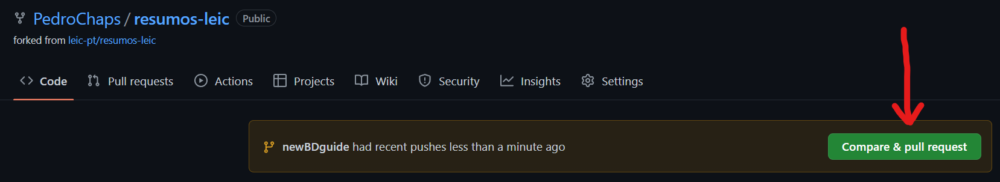
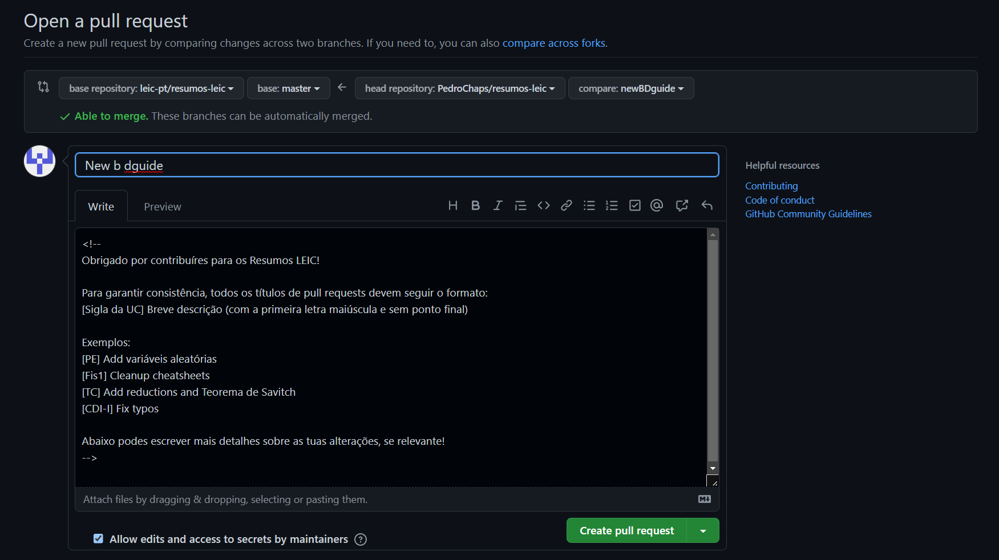

# Submeter alterações

## Efetuar um Commit

Agora que já fizeste as alterações no teu computador, podes fazer um PR
([Pull Request](https://www.pagerduty.com/resources/learn/what-is-a-pull-request/)),
ou seja, passar pelo processo de submissão para o repositório oficial,
e, consequentemente, para o website oficial.

Para isso, começas por proceder como se estivesses a trabalhar num repositório só teu:

1. Fazer _commit_ das alterações (e.g. `git commit -m "[BD] Add guide for .cgi hosting"`);
2. Fazer _push_ para o **_teu_** repositório (_origin_) com as alterações (i.e. `git push`);

## Abrir um Pull Request

Assim que tiveres feito _push_ para o **_teu_** repositório, irá aparecer a opção de fazer
um pull request no _GitHub_:



!!! info

    Alternativamente, caso essa opção não apareça, podes ir à página de
    [comparar alterações](https://github.com/leic-pt/resumos-leic/compare),
    clicar em _compare across forks_ e selecionar o teu repositório/_branch_
    no _head repository_ e _compare_, respetivamente.
    De seguida, clica no botão verde _Create pull request_.

Irá então aparecer uma página que permite escrever um titulo e uma descrição do _pull request_.



!!! success "Título do _Pull Request_"

    É importante seguir o formato para o título descrito no comentário da descrição:

    > Para garantir consistência, todos os títulos de pull requests devem seguir o formato:
    >
    > `[Sigla da UC] Breve descrição (com a primeira letra maiúscula e sem ponto final)`

Assim que o título e a descrição estiverem escritas, basta clicar no
botão _Create pull request_ e o pedido de alterações será feito com sucesso!

!!! note "Porque se chama _pull request_ e não _push request_?"

    Poderão existir dúvidas na nomenclatura usada - porquê _Pull request_ e não _Push request_,
    visto que estamos a "empurrar" conteúdos para o repositório principal?

    Esta dúvida é perguntada [muitas vezes](https://stackoverflow.com/questions/21657430/why-is-a-git-pull-request-not-called-a-push-request).

    A ideia é que fazer _push_ de mudanças locais para um repositório, efetivamente
    significa "enviar" as mudanças para o repositório.
    Nós "empurramos" novo conteúdo (a mesma lógica aplica-se para quando fazemos _pull_).

    Contudo, quando se fala em _pull request_, estamos a pedir (_request_) ao
    repositório de destino que faça _pull_ das nossas mudanças,
    pois nós não somos _maintainers_ do repositório e portanto não temos permissões
    para fazer _push_ - para sermos nós a "empurrar" as mudanças.

## Adicionar Alterações a um Pull Request aberto

Se tiveres um _pull request_ aberto que ainda não foi _merged_, podes ainda efetuar alterações!
Para isso, basta fazeres _commit_ e _push_ para o mesmo branch.

## Pull Request Aceite

Parabéns, o teu _pull request_ foi aceite! E agora?

Existem vários passos que podes ter de fazer:

1.  **Apagar o _branch_ que foi _merged_.** Dado que as alterações já foram aceites,
    o _branch_ deixou de ter utilidade.  
    Caso ainda estejas no branch, volta para o master: `git checkout master`.  
    De seguida, apaga o branch.

    ```sh
    git branch -d <nome do branch>
    ```

2.  **Atualizar a fork.** Já que foram efetuadas alterações no repositório original (_upstream_),
    tens também de atualizar o teu branch `master` para ficar igual ao `master` do _upstream_.

    ```sh
    git checkout master
    git pull upstream master
    git push
    ```

    Alternativamente, o GitHub mostra um botão _Sync fork_ na página do teu repositório,
    onde podes fazer o mesmo. Lembra-te de fazer _pull_ se optares por esta opção.
